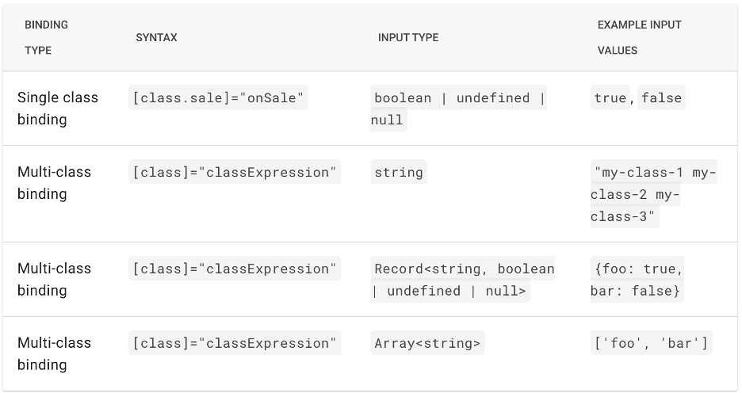

# Angular Interview Questions

## What is Angular?

A component-based framework for developing single page applications (SPAs), that’s built on TypeScript.

## Differentiate between Angular and AngularJS.

AngularJS was version 1 of Angular. It then became just Angular after version 2 was released.

## Benefits of TypeScript?

Type checking is the primary advantage of TypeScript. By adding static typing to the language, you can catch a lot of bugs at build time. They can be fixed before the code is shipped.

TypeScript allows for excellent code autocompletion. If using VS Code, the IntelliSense kicks in to help complete what you want to write - potentially making the dev process faster.

## What is the Angular CLI?

The Angular CLI is a command-line interface tool that you use to initialize, develop, scaffold, and maintain Angular applications directly from a command shell.

## What are the four files generally created by the CLI when creating a Component?

name-of-component.component.html

name-of-component.component.scss

name-of-component.component.spec.ts

name-of-component.component.ts

## What are Angular Modules?

**Note: since Angular 14 standalone components have been part of the Angular ecosystem. These are intended to replace the purpose of ngModule. Nonetheless, it’s worth knowing what Angular modules do and how they fit into the Angular architecture.**

## @NgModule()

NgModules consolidate components, directives, and pipes into cohesive blocks of functionality. Modules can also add services to the application.

An NgModule is a function that takes a single metadata object to define a cohesive block of functionality. This metadata object typically has keys such as: declarations (for components, services and directives), imports (where you can import anything including other modules), exports and providers.

NgModules are still a simple and effective way of organising a codebase when it comes to building very large applications.

## Standalone Components

Standalone components got introduced in Angular 14. The introduction of standalone components means that NgModules are not necessary any more. To be more specific, they do not need to be declared or exported in an NgModule.

Declaring a component as a standalone component is quite easy: in the @Component() decorator, simply add a key-value pair in the metadata object which goes like this:

```
{
standalone: true,
}
```

In this same metadata object, you can also add an imports key whose value is an array of all the directives, pipes, modules and components that are required to make this new standalone component work.

## What is Data Binding?

Data binding establishes a link between the template of the component and the model (component instance to which the template belongs). Angular’s change detection algorithm is responsible for ensuring that the model and view are always synchronised.

Data binding always has two parts: a target in the template’s UI which contains the bound value, and a template expression which produces a value from the model.

There are many examples of data binding such as: text interpolation, property binding, attribute binding, event binding, class and style binding, two-way binding.

### Text Interpolation

This is just using the {{ }} in the view template where inside the curly brackets you have a template expression of some kind which evaluates to something. This is pretty simple and straightforward.

### Property Binding

This is where you can set values for properties of HTML elements or directives. A couple of examples of where you would use this would be to set the src of an img element or to set the disabled status of a button.

Taking the button example, you may have a form that you do not wish to submit unless a bunch of form validation has been done. One way to ensure that the form does not submit is to link the disabled property to the form validation.

In the class statement of a component, you might set a property that looks like this:

`private isValid = false;`

Then in your form, you would have a button component that looks like this:

`<button [disabled]=”!isValid”>Submit</button>`

### Attribute Binding

This is similar to property binding, although there are some differences:

1. Rather than do [src] or [disabled], you would do [attr.src] or [attr.disabled].
2. Note that if the property or expression you use to assign a value evaluates to null or undefined, the attribute gets removed altogether.

### Event Binding

Examples of event binding would be things like (click), (submit), (mousedown) etc.

An example in the view template would be:

`<button (click)=”doSomething($event)”>Click</button>`

### Class and Style Binding



## Pipes

Pipes are usually used to transform values in the view template. There are some built-in pipes that Angular, by default, provides which you can make use of:

1. DatePipe
2. UpperCasePipe
3. CurrencyPipe
4. DecimalPipe
5. PercentPipe
6. AsyncPipe

Note that you can also chain pipes together to get the desired outcome. An example would be something like this:

`<p> The chained hero's uppercase birthday in "fullDate" format is {{ birthday | date:'fullDate' | uppercase}} </p>`

### Pipe Example

```
@Pipe({
name: 'capital',
standalone: true,
})
export class CapitalPipe implements PipeTransform {
transform(word: string): string {
return word.charAt(0).toUpperCase() + word.slice(1);
}
}
```

## Template Reference Variables

Template variables help you use data from one part of a template in another part of the template. Use template variables to perform tasks such as respond to user input or finely tune your application's forms.

An example:

```
<input #phone placeholder="phone number" />
<button type="button" (click)="callPhone(phone.value)">Call</button>
```

Structural directives such as *ngIf and *ngFor, or >ng-template< declarations create a new nested template scope, much like JavaScript's control flow statements like if and for create new lexical scopes.

This example works:

```
<input #ref1 type="text" [(ngModel)]="firstExample" />
<span *ngIf="true">Value: {{ ref1.value }}</span>
```

This one does not:

```
<input *ngIf="true" #ref2 type="text" [(ngModel)]="secondExample" />
<span>Value: {{ ref2?.value }}</span> <!-- doesn't work -->
```

## Directives

There are different types of directives such as attribute and structural directives.

### Structural Directives

Angular provides a bunch of built-in structural directives which affect when and how things are rendered in the view template. The built in structural directives include: ngIf (will show something in the view template when template express evaluates to true); ngFor (good for rendering lists); ngSwitch (useful for rendering things in the view template when you have more than 2 conditions e.g. loading, loaded, error); unless (this is the opposite of ngIf and renders something in the view template when the template expression evaluates to false).

### Attribute Directives

Angular also provides a bunch of built-in attribute directives such as: NgClass (adds/removes sets of CSS classes); NgStyle (inline css styling); NgModel (two-way binding used in forms).

### Custom Directives

Example:

```
import { Directive, ElementRef, HostListener, Renderer2 } from '@angular/core';

@Directive({
selector: '[appTest]',
standalone: true,
})
export class TestDirective {
constructor(private elementRef: ElementRef, private renderer: Renderer2) {}

@HostListener('mouseenter', ['$event.target'])
onMouseEnter() {
this.renderer.addClass(this.elementRef.nativeElement, 'yellow-background');
}

@HostListener('mouseleave', ['$event.target'])
onMouseLeave() {
this.renderer.removeClass(
this.elementRef.nativeElement,
'yellow-background'
);
}
}
```

## Component Communication

There are four main ways that components can communicate with another: via an input; via an output (from child to parent components); via an @ViewChild (injecting child component into parent component so that parent’s class can access the methods and properties of the child’s class); via a service.

### @Input()

Passes data from a parent component into a child component.

### output<<data_type>>()

Passes data from a child component up to a parent component.

### @ViewChild()

Allows a parent component to gain access to the properties and methods contained inside the child component’s class.

### Service

Services are a very useful way of avoiding prop drilling. If you have a very nested component tree, you can simply use a service to link two components together that are very far away from one another in the component tree.

## Lazy Loading

Example of lazy loading:

```
import { Routes } from '@angular/router';
import { TemperatureConverterPageComponent } from './pages/temperature-converter-page/temperature-converter-page.component';
import { NotFoundPageComponent } from './pages/not-found-page/not-found-page.component';
import { WeatherDetailsPageComponent } from './pages/weather-details-page/weather-details-page.component';
import { FootballRecordsPageComponent } from './pages/football-records-page/football-records-page.component';

export const routes: Routes = [
{ path: 'temperature', component: TemperatureConverterPageComponent },
// { path: 'weather', component: WeatherDetailsPageComponent },
{
path: 'weather',
loadComponent: () =>
import(
'./pages/weather-details-page/weather-details-page.component'
).then((r) => r.WeatherDetailsPageComponent),
},
// { path: 'football', component: FootballRecordsPageComponent },
{
path: 'football',
loadComponent: () =>
import(
'./pages/football-records-page/football-records-page.component'
).then((r) => r.FootballRecordsPageComponent),
},
{ path: '', redirectTo: 'temperature', pathMatch: 'full' },
{ path: '**', component: NotFoundPageComponent },
];

```

## Explain Dependency Injection

Put simply, DI is where a component/directive/class etc. relies on another service to function properly. One of the main benefits of DI is that it gives a developer more flexibility when creating their application.

In Angular, dependencies are typically services, but they also can be values, such as strings or functions.

Two main roles exist in the DI system: dependency consumer and dependency provider.

An example of DI is when you use a service to pass data from a grandchild component up to a grandparent component in order to avoid prop drilling. To achieve this, you would do the following:

1. Define the service (usually a class) and add the @Injectable() decorator at the top. Note that the @Injectable() decorator will, sometimes, contain an object that may look like this:

```
{
providedIn: ‘root’
}
```

    By including this object, it makes the service available throughout your application. When you provide the service at the root level, Angular creates a single, shared instance of the service and injects it into any class that asks for it. If you don’t include it, you will usually need to add the service in the providers array for a component/directive/service etc.

2.  Declare it in the class constructor of the component (using the example in the para above, this would be the grandchild component) that needs to make use of it. This is the most common way to inject a dependency. An alternative is to use the inject method which looks like this:

                                            private service = inject(MyService)

3.  Provide it in the grandparent component using the providers array of the component decorator. Then you can subscribe to the service to get the data. Note that by providing it the service this way, each instance of the component will have its own instance of the service.

Note that you can inject services into other services. Injecting a service into another service should follow the same patterns as when you are injecting a service into a component.

## What are Angular lifecycle hooks?

A component goes through 4 phases in its life: creation (stuff that happens in the constructor), change detection, rendering and destruction. All but 1 angular lifecycle methods happen in the change detection phase – the remaining one happens in the destruction phase. As a result, the creation and rendering phases will be ignored.

In the change detection phase, these lifecycle methods occur (usually in this order): ngOnInit (runs after all a component’s inputs have been initialised but before the template is initialised), ngOnChanges (runs every time a component’s inputs have changed), ngDoCheck, ngAfterContentInit, ngAfterContentChecked, ngAfterViewInit, ngAfterViewChecked.

In the destruction phase, the lifecycle method that runs is ngOnDestroy. The ngOnDestroy lifecycle method is usually used for things like unsubscribing from a subscription.

Commonly used ones would be ngOnInit, ngOnChanges, ngAfterViewChecked and ngOnDestroy.

## Forms

It’s important to note that there are two types of forms in Angular: template driven forms and reactive forms. To be clear, it’s usually better to use reactive forms than template driven forms.

### Template-Driven Forms

There are some core features of a template-driven form that should be noted. First, the FormsModule must be imported into the TS file for the relevant component. The second feature is to add some stuff to the `<form>` tag: a template reference variable that = ngForm (e.g. #signUpForm=”ngForm”); the ngSubmit directive ((ngSubmit)=”someFunction()”). Third, you will want to declare a property in the TS file – usually an object – which will define the shape of the data of your form. For example, if you were dealing with a sign up form, you could define a variable called ‘user’ and have it take the form of:

```
{
name: ‘’,
email: ‘’,
password: ‘’
}
```

The next thing to after this is to use ngModel. For each `<input/>` in your form, you would have an [(ngModel)]=”” (e.g. [(ngModel)]=”user.name”). Note as well that each input should have a ‘name’ property which is identical to the key in your property (e.g. <input name=”email” /> for the input tracking user.email). The next thing is a @ViewChild which would take the name of your form. Using the example above, your @ViewChild could look like:

`@ViewChild(‘signUpForm’) form: NgForm;`

Sometimes as well you may wish to have error messages appear if the user does not fill the input correctly. In this scenario, you will need a different div/section/paragraph etc. that displays the error message. Say, for example, the user does not fill in a password input correctly: you could have something on the password input that looks like this:

              `<input [(ngModel)]=”user.password” #password=”ngModel” />`

By using the ngModel at the end of the previous line, you can access classes that have been applied to the input (e.g. ‘dirty’, ‘pristine’ etc.). Using those classes, you can then do some conditional logic which determines when that error message is shown.

### Reactive Forms

It’s best to build reactive forms by injecting the FormBuilder service. This then allows you to group together the FormGroups and FormControls that make up your form in a less verbose way (no need to use FormGroup and FormControl constructors continuously) in the class statement. That way, each FormControl is an array which takes two arguments: the first is an initial value that the formControl should have when the form is first initialised; the second is an array of validation rules that should be applied to control what the user can submit.

Note that the FormGroup gets added to the component’s template like this:

'<form [formGroup]=”myForm”>…</form>'

And the formControl gets added to the view template like this:

'<input formControlName=”name”/>'

There are some key methods and properties which you can use on a reactive form:

1. valueChanges. ValueChanges is an observable that allows you to pipe, process and subscribe to changes in the form that the user is performing. An example of how to access it would be:

`this.form.valueChanges.pipe…..`

2. setValue. This allows you to set the value of the whole form (it does not allow you to partially update the form). An example on how to use the function would be:
   `this.form.setValue({….})`

3. patchValue. This is the function you would call if you only want to partially update the value of a form.
4. Reset. Reset allows you to return the form to its original state. This might be used in the aftermath of when a user elects to submit a form.

### Reactive Forms vs Template-Driven Forms

Probably wiser to use reactive forms in most cases. There are multiple reasons for why this is:

1. Template (HTML) of the component is cleaner due to business validation rules being moved to the component’s class statement (TS file). It’s easier to define and maintain business validation rules in the class statement rather than attaching loads of directives in the template.
2. Allows for easy building and scaling up of more complex forms.
3. Business validation rules can be unit tested more easily because they are now in the component’s class statement rather than in the component’s template.
4. Using reactive forms makes defining the form data dynamically easier. A case would be where a form gets defined via a HTTP request for backend data.
5. Reactive forms use an Observable-based API. This means that the form and all of its controls can be viewed as a continuous stream of values – which can be processed and subscribed to using RxJS operators (e.g. map and filter). This can be seen as advantageous because you can pipe (from the valueChanges observable) and process (e.g. using map/filter/debounceTime etc.) what the user does and only update the form’s value when what the user does is valid.
6. Easier to write a custom validator rule.

## Basic HTTP Requests (HTTP Client)

As of v18 of Angular, to make some basic HTTP requests there are some pre-requisite steps that must be taken:

1. Go to the app.config.ts file and in the providers array (of the application config) insert the provideHttpClient().
2. Next, you need to inject the HttpClient service into your relevant service/component etc.

Note that making a HTTP request is quite simple in Angular. Here is an example of how you might write some code which executes a HTTP request (this specific example is from a service):

```
constructor(private http: HttpClient) {}

getFootballRecords(pageNumber: number) {
    return this.http
      .get<FootballRecordApiResponse>(
        `http://localhost:5000/api/football?pageNumber=${pageNumber}`
      )
      .pipe(
        tap((response) => this.updateTotalPages(response.total_pages)),
        map((response) => response.data)
      );
  }

```

From this code snippet above, there are some things that should be noted. First, that where it says 'get' is where you normally put the type of HTTP request that you wish to make (e.g. get, post, delete etc.). Second, that where the url is specified actually has 2 possible parameters (where the second is optional) - the second after the url is an options object which differs depending on the type of HTTP request that is made. Third, based on the fact that the pipe operator has been included, it should be concluded that a HTTP request in Angular returns an Observable.

## HTTP Interceptors

HTTP interceptors are used for a variety of tasks in an Angular application such as:

1. Applying global HTTP headers to outgoing requests
2. Caching responses for a certain period of time
3. Customising the parsing of responses

Think of HTTP interceptors as middleware in your application. This means an Interceptor takes two parameters:

1. HTTPRequest (e.g. get, post etc.)
2. A next parameter (of interface HttpHand)

HTTP Interceptors are integrated into an Angular app by going to the app.config.ts and inside the provideHttpClient() using the withInterceptors function. An example is as follows:

```
provideHttpClient(
    withInterceptors([loggingInterceptor, cachingInterceptor]),
  )
```

## Services

Services are one of the fundamental building blocks of Angular. They're used throughout an Angular application for multiple reasons:

1. Avoid repeating code.
2. Avoid burdening components/directives/other services with too many responsbilities. In short, a service will have a narrow, well-defined purpose and perform that purpose well.
3. Sharing state amongst various components and also avoiding prop drilling.

### Sharing state

This point deserves particular attention because you can inject a single intance of a service into your application which is shared by a number of components/directives/services. This is achieved by making sure your @Injectable decorator contains an object that has this property and value:

`{providedIn: 'root'}`

Alternatively, let's imagine you have an application with a bunch of widgets on the page that all need their own instance of a particular service. In this case, you simply removed the providedIn property from the @Injectable() decorator to ensure this happens.

## Content Projection (with ng-content)

Content projection is where you may need to insert different types of HTML content into a component. For example, you may be using a for loop structural directive (@for/\*ngFor) where each item in the array you are iterating through needs to be inserted into a component in the same part of the component. Content projection with ng-content makes it easy to achieve this goal.

Example of content projection

```
<div formGroupName="addOns">
  @for(addOn of addOns; track $index) {
    <app-add-on
     [value]="addOn"
     [yearly]="yearlyPayment"
    [class.add-on-test]="addOnCheckbox.checked"
   >
      <mat-checkbox
       #addOnCheckbox
       color="primary"
      [formControlName]="addOn.formControlName"
     (change)="updateAddOns($event, addOn.formControlName)"
     ></mat-checkbox>
  </app-add-on>
  }
</div>
```

In this HTML template above, the HTML that will get projected inside the addOn component (app-add-on) is the mat-checkbox. To ensure it’s rendered properly and precisely in the addOn component, all you have to do is go to the HTML file for the addOn component and add the tag `<ng-content />` where you want the HTML to be displayed.

## Basic Routing

### Defining routes in your application

As of Angular v18, routes are relatively simple to set up. First, when creating a new Angular app, an app.routes.ts file is automatically generated by the Angular CLI. In here, this is where you will define routes.

### Integrating the routes into your application

The Angular CLI will have also auto-generated a file called app.config.ts – this is where you need to register your routes.
Ensuring RouterOutlet is in the app component

Go to the TS file and ensure that RouterOutlet is in the imports array inside the @Component decorator. Once that’s done, go the HTML file and ensure that there is a:

`<router-outlet></router-outlet>`

In the file.

## Router Params (accessing them)

Accessing router params can be useful in certain circumstances. This section includes snippets of another codebase which uses this feature to achieve some functionality.

### Setting up a dynamic route

Router params are only relevant when you have set up dynamic routes in your application. Here is an example of a dynamic route:

```
export const routes: Routes = [
  { path: 'countries/:country', component: CountryDetailsPageComponent },
];
```

From this snippet above, the dynamic part of the url is the fragment '/:country' - the value of '/:country' could be 'france', for example, where the url would end '.../countries/france'. This particular fragment of the url would be accessible to any component that is loaded when that fragment appears in the url.

### Accessing Router Params

The CountryDetailsPageComponent accesses the country name url fragment by executing the following code:

```
  countrySubscription!: Subscription;

  constructor(
    private _location: Location,
    private activatedRoute: ActivatedRoute,
    private countryDetails: CountryDetailsService
  ) {}

  ngOnInit(): void {
    this.countrySubscription = this.activatedRoute.paramMap.subscribe(
      (params: ParamMap) => {
        const countryName = params.get('country');
        const country = countries.find(
          (country) => country.name.common === countryName
        );
        country && this.countryDetails.dispatch(country);
      }
    );
  }
```

The first thing to note from this code snippet above is the use of the ActivatedRoute service - without this service you cannot access the value of a url fragment. The ActivatedRoute service has an observable property called paramMap which allows you to subscribe to and access the url fragment. Note where it says `params.get('country');` - the 'country' matches the name ':country' in the original route. Something else to note - which is quite convenient - is that even if the value of the url fragment has to be encoded due to the inclusion of a space, this will not appear when you access it via the paramMap. For example, imagine if the country in the snippet above took the value of 'United Kingdom' - the actual url would end 'united%20kingdom'. However, when you access this url fragment, it will be 'United Kingdom' without the url encoding.

## Route Guards

## Change Detection

Change detection is the mechanism used by Angular to see if any application state has changed and whether the DOM needs to be updated.

The default change detection strategy for a component is simply 'default'.

There are occasions where the default change detection strategy runs too frequently and has an adverse impact on performance. In this instance, it may be appropriate to change the change detection strategy to onPush.

To apply this new change detection strategy, go to the relevant @Component decorator whose change detection strategy you wish to change and add the following:

`{..., changeDetection: ChangeDetectionStrategy.OnPush}`

By adding this property and value to a component's decorator, the change detection mechanism will only run in certain instances:

1. When a component's input changes.
2. When a component emits an event.
3. When an observable property fires an event.

Otherwise the change detection mechanism will not run.

## Angular Signals

## Testing

## NgRx

This section will focus solely on global NgRx (as opposed to, say, ComponentStore NgRx).
